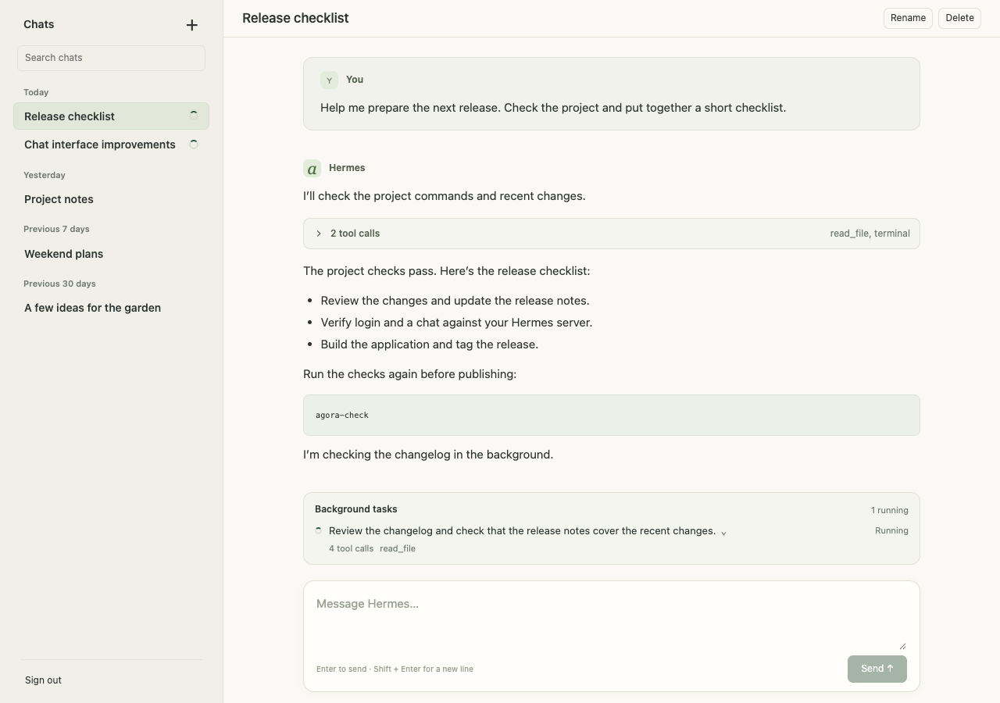

# Agora

A focused chat client for [Hermes Agent](https://github.com/NousResearch/hermes-agent).
Run it on your laptop and connect to your own Hermes server, or host it alongside
the Hermes dashboard. Hermes runs the agent, stores conversations, and handles
sign-in. Agora provides the chat interface.

> [!WARNING]
> **Hosting Agora on its own domain with the Node bridge requires a Hermes change.**
> Hermes must allow the exact HTTPS callback
> `https://<your-agora-domain>/auth/native/callback` in its native PKCE broker.
> The source baseline only allows localhost callbacks. Setting an OIDC-provider
> callback or adding CORS headers does not enable this. Apply the callback
> allowlist patch in your Hermes build before using hosted bridge login.
> Laptop mode works with unmodified Hermes.

- Streamed replies, Markdown in user messages and replies, code, and inline generated images.
  Messages sent through another client appear in the open chat when its turn starts.
- Attach images with the paperclip, paste from your clipboard, or drop files onto
  the composer. Review/remove previews before sending; image-only messages work.
  Supports PNG, JPEG, WebP, and GIF, up to 8 images of 10 MB each.
  Click any chat image to enlarge it and download it from the viewer; close with Escape, the close button, or
  a click outside the image viewer.
- Memory view with saved notes, user preferences, soul and custom instructions,
  provider status, readable inline approvals, and staged-write previews.
- Results between Chats and Memory: a read-only, newest-first feed of scheduled
  job outputs, with **All results** or a single sidebar job and run-status filtering.
  Assistant replies use safe Markdown; run conversations and older messages open
  on demand. **Manage job** opens that exact job in Cron. Script-only output is
  labeled as a limited preview, not a full result. Hermes returns at most 100
  recent runs per job, not an unlimited archive.
- Cron workspace to create/edit scheduled jobs, pause/resume, run now, delete,
  and inspect recent runs and their conversations.
- On-demand provider quota and credit balances, with a picker for multiple providers.
- A compact chat list grouped by date, with running and unread-reply indicators.
  Search loaded titles and stored message text; cron-job conversations are excluded.
- Local conversation pins: use the pin icon on a chat row or in its header.
  Pinned chats stay above the date groups, including older chats. Pins are scoped
  to the Hermes endpoint and profile, and stay in this browser; they do not sync.
  Only IDs are stored locally, not titles or messages.
- A conversation switcher on **⌘K / Ctrl+K**. Type to search, use ↑/↓ to choose,
  Enter to open, and Escape to close.
- Expandable tool activity and background-task progress, results, and errors.
  Running tasks stay above the composer; finished tasks remain in the transcript.
- Model and reasoning-effort choices scoped to each conversation.
- Slash commands with server-provided suggestions: type `/`, choose with ↑/↓ and
  Enter or Tab, add arguments, then send. Command output appears in the chat.
- Command approval cards with readable command text, **Allow once**, and **Reject**.
  Remembered approvals appear only when Hermes offers them. Clarification questions
  can be answered directly in chat.
- Masked browser-login prompts for saving a website login, unlocking a password
  manager, and entering a verification/2FA code. Values go through Hermes's input
  request channel, not chat messages; Agora does not save them in browser storage.
  Inputs clear on submission, cancellation, or disconnection. Requires Hermes's
  vault server-request hooks; this does not embed or control a browser in Agora.
- **Passwords & Logins** workspace: search saved login metadata, add a login
  directly to Hermes's vault, confirm removal of local logins, and inspect source
  readiness. Passwords are never revealed; external manager entries are read-only.
  Requires Hermes's `vault.list`, `vault.sources`, `vault.add`, and `vault.remove`
  gateway methods. No Hermes API changes or separate credential database.
- New chats, history, rename, delete, and stop controls.
- **Steer** a running turn with text from the composer, or press Enter. Hermes
  accepts the guidance without interrupting the turn and applies it when safe;
  a compression race can queue it for a later turn. Images and approval prompts
  must be handled separately. Rejected steers stay in the draft; uncertain sends
  are never automatically retried. Requires Hermes `session.steer` support.
- Opt-in desktop notifications when a response finishes while Agora is unfocused.
  Enable **Notifications** at the bottom of the Chats sidebar and allow the browser
  permission prompt. Notifications contain no conversation title or response text;
  clicking one opens its chat. Agora must stay open and connected; closed or
  suspended apps require Web Push, which is not implemented. HTTPS or localhost
  and desktop browser notification support are required.
- Automatic light/dark appearance and a layout that works on desktop and mobile.

<picture>
  <source media="(prefers-color-scheme: dark)" srcset="docs/screenshots/chat-dark.png">
  
</picture>

*The application with sample conversation data. The screenshot follows your light or dark appearance.*

## Run on your laptop

You need:

- Nix with flakes enabled, plus direnv configured with Nix support.
- A running Hermes **built-in dashboard** reachable from your laptop.
- For authenticated remote use, Hermes must advertise `native_pkce` in
  `GET /api/status` and have its sign-in provider configured.

Agora connects to Hermes's dashboard HTTP APIs and chat WebSocket. It does not
connect to `hermes-webui` or the separate Hermes API-server interface.

Clone this repository, then run these commands from its root:

```sh
direnv allow
npm ci
cp .env.example .env.local
```

Edit `.env.local` and set your server address:

```dotenv
HERMES_ENDPOINT=https://hermes.example.com
```

Start Agora:

```sh
agora-dev
```

Open **http://127.0.0.1:5173/** and click **Sign in with Hermes** if prompted.
Complete the sign-in in your browser. Keep the local process running while using
Agora. Restart it after changing the endpoint.

The local service connects to remote Hermes on your behalf, so Hermes does not
need to host Agora or enable browser CORS. Login survives page refreshes;
restarting the local process requires signing in again. Desktop packaging is not
implemented yet.

### Configuration

| Setting | Purpose |
| --- | --- |
| `HERMES_ENDPOINT` | Remote dashboard URL for the Node bridge. HTTPS is required except for loopback test servers. URL path prefixes are supported. |
| `VITE_HERMES_PROFILE` | Optional Hermes profile. Omit it to use the server's launch profile. Vite reads this when starting development or building the UI. |
| `AGORA_PUBLIC_ORIGIN` | Optional canonical HTTPS origin, e.g. `https://agora.example.com`. Enables hosted bridge login; requires the Hermes callback allowlist change. Omit for laptop mode. |
| `AGORA_PORT` | Port for `agora-start`; defaults to `5173`. |
| `HERMES_TARGET` | Development proxy target when `HERMES_ENDPOINT` is omitted; defaults to `http://127.0.0.1:8080`. |

Keep provider credentials on Hermes. `.env.local` is ignored by Git.

### Run the built application

From the development shell:

```sh
npm run build
agora-start
```

Open the same local URL. This serves `dist/` without development hot reload.
`HERMES_ENDPOINT` is read at startup, so changing the server does not require a
new build. Changing `VITE_HERMES_PROFILE` does.

Thinking appears as a collapsible item in the conversation. Open it to read the
reasoning text or summaries Hermes provides; some providers do not expose a trace.

Context compression shows a pinned spinner above the message box, including when
you run `/compress`. It clears when Hermes finishes or resumes normal work.

## Development

The app uses Vue, TypeScript, and Vite. The Nix shell provides Node.js 24, npm,
Git, ripgrep, and the project commands. The flake supports Apple Silicon macOS
and x86_64/aarch64 Linux.

After `direnv allow` and `npm ci`:

| Command | Purpose |
| --- | --- |
| `agora-dev` | Start the development server with hot reload. |
| `agora-check` | Run type checking, tests, and the production build. |
| `npm run typecheck` | Check TypeScript and Vue components. |
| `npm test` | Run the Vitest suite. |
| `npm run build` | Build the UI into `dist/`. |
| `agora-start` | Serve a built UI with the local Hermes connection service. |
| `agora-screenshot` | Regenerate the README screenshots using sample data. |
| `agora-icons` | Regenerate raster favicons from the original [icon](docs/branding/icon.png). |

Without direnv, use the same Nix environment explicitly:

```sh
nix develop path:. --command npm ci
nix develop path:. --command agora-dev
```

Before submitting changes:

```sh
nix develop path:. --command agora-check
nix flake check path:. --no-build
```

Commit changes to `package-lock.json` or `flake.lock` when changing dependencies
or Nix inputs. Dependencies (`node_modules/`), build output (`dist/`), and local
configuration are ignored by Git.

To regenerate the screenshots, run `agora-screenshot`. It uses Playwright with
an installed Chrome/Chromium browser, automatically finding Chrome on macOS.
Set `AGORA_BROWSER_PATH` if your browser executable is elsewhere. The command
starts its own temporary server and mocks Hermes responses; it does not access
your server or include your conversation history.
Set `AGORA_SCREENSHOT_DIR` to save all screenshots outside `docs/screenshots`.
The browser smoke also verifies Passwords & Logins with fictional credentials.

### Code layout

| Path | Responsibility |
| --- | --- |
| `src/App.vue` and Vue components | Chat interface, sidebar, tool/task views, and sign-in. |
| `src/hermes/chat.ts` | Conversation state, streaming, recovery, approvals, and session switching. |
| `src/hermes/api.ts`, `gateway.ts`, `types.ts` | Hermes HTTP and WebSocket contracts. |
| `src/hermes/transcript.ts`, `media.ts` | History normalization and image loading. |
| `src/ResultsView.vue`, `src/hermes/results.ts` | Read-only scheduled outputs, evidence-based status, bounded reads, and run inspection. |
| `src/PasswordsView.vue`, `src/hermes/vault.ts` | Profile-scoped login metadata, direct vault writes, and read-only source status. |
| `src/theme.css`, `src/style.css` | System appearance and shared layout. |
| `server/` | Local/hosted login, authenticated API/WebSocket forwarding, and production serving. |
| `tests/` | Interface, transport, protocol, authentication, and recovery tests. |

Keep Hermes protocol and authentication logic outside Vue components. Verify
upstream contracts before changing request parameters or event handling.

## Nix package and NixOS

Build or run the packaged application directly from the flake:

```sh
nix build github:victorjacobs/agora
HERMES_ENDPOINT=https://hermes.example.com nix run github:victorjacobs/agora
```

For a local checkout, use `nix build .` or `nix run .`. The package includes
Node.js and production dependencies. Open `http://127.0.0.1:5173/`.

To use Agora in a NixOS configuration flake:

```nix
{
  inputs.agora.url = "github:victorjacobs/agora";
  inputs.agora.inputs.nixpkgs.follows = "nixpkgs";

  outputs = { nixpkgs, agora, ... }: {
    nixosConfigurations.my-machine = nixpkgs.lib.nixosSystem {
      system = "x86_64-linux";
      modules = [
        ./configuration.nix
        agora.nixosModules.default
        {
          services.agora = {
            enable = true;
            hermesEndpoint = "https://hermes.example.com";
          };
        }
      ];
    };
  };
}
```

Add these entries to your existing configuration flake, which must already
declare `inputs.nixpkgs`. The module builds Agora with your system's Nixpkgs.
Its service listens on loopback. Use it directly on a laptop or behind an HTTPS
reverse proxy when `publicOrigin` is configured.

Exports are `packages.<system>.default` (also named `agora`) and
`nixosModules.default` (also named `agora`). The implementations remain in
[nix/package.nix](nix/package.nix) and [nix/module.nix](nix/module.nix), which can
also be imported directly. See [Nix packaging and NixOS](docs/nix.md) for profile
overrides, service options, and hosted deployment.

## Host Agora on its own domain

> [!WARNING]
> **This mode requires the Hermes HTTPS callback allowlist patch described above.**
> Agora does not apply that patch. An unmodified Hermes on the documented source
> baseline will reject hosted sign-in.

Run the production Node service behind Caddy or Nginx. It serves the UI and
handles API/WebSocket forwarding to your Hermes installation:

```dotenv
HERMES_ENDPOINT=https://hermes.foo.bar
AGORA_PUBLIC_ORIGIN=https://agora.foo.bar
```

```sh
npm run build
agora-start
```

The service listens at `127.0.0.1:5173`. Proxy the entire Agora domain to it:

```caddyfile
agora.foo.bar {
    reverse_proxy 127.0.0.1:5173
}
```

On NixOS, import the module and configure:

```nix
services.agora = {
  enable = true;
  hermesEndpoint = "https://hermes.foo.bar";
  publicOrigin = "https://agora.foo.bar";
};
services.caddy = {
  enable = true;
  virtualHosts."agora.foo.bar".extraConfig = ''
    reverse_proxy 127.0.0.1:5173
  '';
};
networking.firewall.allowedTCPPorts = [ 80 443 ];
```

Point Agora's DNS at the proxy. Keep Hermes's `dashboard.public_url` and its
OIDC-provider callback on the Hermes domain. Configure the patched Hermes broker
to allow exactly `https://agora.foo.bar/auth/native/callback` as its final client
callback. The configuration key depends on your Hermes patch; it is not an
existing setting in the documented baseline. No CORS or Hermes proxy Host/Origin
changes are needed.

Browser session cookies are Secure and HttpOnly. Access/refresh tokens stay in
the Node process's memory; refreshing Agora keeps the login, restarting the
service requires signing in again. Run one bridge process per deployment.
See [NixOS hosting](docs/nix.md#public-hosting-with-the-node-bridge) and
[authentication details](docs/integration.md#hosted-node-bridge).

Static hosting through Hermes's browser-cookie flow is also described in the
[integration notes](docs/integration.md#hosting-at-the-domain-root).

## Behavior and compatibility

Touchscreen page zoom is intentionally disabled throughout Agora. In the image
viewer, pinch or use the zoom buttons/wheel to enlarge only the image, drag to
pan, and use **Fit** to reset. The viewer controls and the rest of the UI stay
the same size. Single-finger scrolling outside the image viewer and desktop
keyboard/browser zoom remain available. Touch-device text fields use at least
16px text to avoid iOS focus zoom. Physical iPhone/iPad gesture behavior still
needs confirmation.

On touch devices, submitting a message or steer dismisses the keyboard without
reopening it when Hermes responds. Desktop submissions keep composer focus.

Links in messages and reasoning traces request a separate browser context instead
of replacing Agora. In an installed iOS/iPadOS PWA, ordinary HTTPS link clicks use
`firefox://open-url?url=…` to request the separate Firefox app, not the in-app
browser. Firefox must be installed; this targets Firefox explicitly rather than
detecting the OS default browser. There is no browser picker or automatic fallback
when Firefox is unavailable. Physical-device confirmation is still required.
Original link destinations remain intact for copying
and long-press menus. Ordinary browser tabs, other platforms, modified clicks,
HTTP/relative links, and other URL schemes retain normal link behaviour.
Sign-in stays in Agora's existing flow; image previews and downloads are unchanged.

Agora keeps access/refresh tokens in the bridge process's memory. Drafts,
transcripts, and unread markers are not persisted in browser storage. Hermes
retains saved conversation history.

Losing a connection does not stop an agent. Agora recovers history and runtime
state before enabling actions. If a send's outcome is uncertain, it retains the
draft and asks you to check the conversation; it never automatically resends it.

Generated images load through Hermes's authenticated media routes. Remote-image
previews depend on Hermes's CDN allowlist. Background-task visibility depends on
the gateway's supported events and session-scoped roster.

Provider quota is available in the sidebar footer. Choose a provider to see its
remaining limits, reset times, or credit balance. Agora queries Hermes’s read-only
`hermes usage --provider … --json` command through the gateway; credentials stay
on Hermes. Providers without a quota endpoint, or older Hermes versions without
this command, show quota as unavailable. Checking quota does not change the chat’s
model or start an agent turn.


The source-verified compatibility baseline is Hermes revision
[`e1fdf003a668f97bf5a53d7675c1e70b1dcfec34`](https://github.com/NousResearch/hermes-agent/tree/e1fdf003a668f97bf5a53d7675c1e70b1dcfec34).
Tests use synthetic Hermes responses; full authenticated live acceptance testing
is still pending. Check the [integration notes](docs/integration.md) when using a
different revision. Dashboard access is access to the operator's Hermes
installation; Agora does not provide independent per-user isolation.

Memory review is available from the Memory icon in the left rail. Inline
approval cards show the change and offer **Save this change** or **Reject**.
The view also loads staged-write previews for the selected conversation’s profile.
Hermes currently truncates staged proposals and does not expose a full review API,
so Agora shows those as previews without approval buttons. No Hermes patches,
internal-file access, or changes to the memory approval policy are required.

The same sidebar includes **Saved memory**, **User profile**, **Soul & instructions**,
and **Memory providers**. These show the selected conversation's
profile (or Hermes's current profile when no conversation is selected). Open a
saved entry to load its complete text; the list shows previews. Use **Edit** to
change the text or **Delete** to review and confirm removal. Changes go directly
to Hermes and refresh the list after success; unsupported writes show an error.
Soul, instructions, and provider status remain read-only. External memory
providers may hold additional data that Hermes's built-in memory APIs do not
expose. Unsupported sections show their error without blocking the others.
Inspection loads on opening a section or clicking Refresh, with no background
polling or browser persistence.

## Further documentation

- [Product scope](docs/product.md)
- [Integration, authentication, and deployment](docs/integration.md)
- [Implementation handoff and upstream research](docs/implementation-handoff.md)
- [Contributor/agent instructions](AGENTS.md)
- [Upstream attribution](THIRD_PARTY_NOTICES.md)

## Cron jobs

Open **Cron jobs** in the left rail. Jobs belong to the current chat's Hermes
profile, or Hermes's active profile before a chat is selected. Use **+** to create
one; schedules accept cron expressions, intervals (for example `every 30m`), or
one-time dates. Hermes validates and executes the schedule. Optional execution
settings include model/provider, skills, an existing server-side script, and a
working directory. Editing preserves settings that Agora does not expose.

The pane refreshes every 15 seconds while visible, except during editing or
confirmation. **Run now** and **Delete** require confirmation. Triggering a paused
job also resumes it in Hermes. Failed writes are never automatically retried;
refresh before repeating an action if its outcome is uncertain.

Recent runs show Hermes's status and usage data. **View conversation** loads a
read-only transcript in a focused dialog; close it with **Close**, Escape, or a
click outside to return to the job. It does not resume or interrupt scheduler-owned
sessions. Refresh an open transcript to see newer messages. Script-only runs show
the output preview returned by Hermes, which may be truncated. The run list is
limited to the latest 100 runs supported by the API. This requires Hermes's
built-in `/api/cron/jobs` endpoints; Agora does not patch Hermes or read its files.
